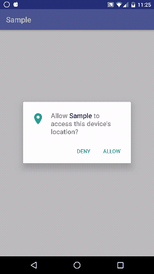

# Reactive Permissions

[](https://www.apache.org/licenses/LICENSE-2.0)
[](https://bintray.com/maxcruz/maven/reactive-permissions)

Deal with Android M permissions in runtime in a simple way with reactive programming. This library was developed in [__Kotlin__](./README.md) but can [interoperate](https://kotlinlang.org/docs/reference/java-to-kotlin-interop.html) with [__Java__](./README-Java.md).

- You may define the permissions that you need (one or many at once). Each permission must be set in the Manifest

- First verify if the permission is already granted, otherwise request to the user

- Each permission may contain a string resource explaining why your app requires this permission. If the user denied the permission, the explanation is displayed with the possibility to retry or skip. Explanation can be omitted if the context is clear.

- If some permissions are very important for your app functionality, you can define that can't continue without this. When an essential permission is denied, a special block dialog is displayed with retry or close options.

- If the user choose the option "never ask again", the retry button in the block dialog opens the preferences of the app.

### Flow

[](./images/flow.svg)

### Example 

View an example in a simple activity [here](https://github.com/MaxCruz/reactive_permissions/tree/master/sample)



### Setup

Make sure you have configured the repository __jcenter()__, it is almost always there

Add this to the gradle dependencies for your module:
```gradle
compile 'com.github.maxcruz:reactive-permissions:1.1'
```
### Usage for Kotlin, [read here](./README-Java.md) for Java implementation

Define permissions as needed:
```kotlin
val camera = Permission(
        Manifest.permission.CAMERA, // Permission constant to request
        R.string.rationale_camera, // String resource with rationale explanation
        true // Define if the app can continue without the permission
)

val location = Permission(
        Manifest.permission.ACCESS_FINE_LOCATION,
        R.string.rationale_location,
        false // If the user deny this permission, block the app
)


val contacts = Permission(
        Manifest.permission.READ_CONTACTS,
        null, // The context is clear and isn't needed explanation for this permission
        true
)

// Put all permissions to evaluate in a single array 
val permissions = listOf(location, camera, contacts)
```

Create the library object for the request
```kotlin
// Define a code to request the permissions
private val REQUEST_CODE = 10
// Instantiate the library
val reactive: ReactivePermissions = ReactivePermissions(this, REQUEST_CODE)
```

Subscribe to observe results __Pair&lt;String, Boolean&gt;__
```kotlin
reactive.observeResultPermissions().subscribe { event ->
    if (event.second) {
        Toast.makeText(this, "${event.first} GRANTED :-)", Toast.LENGTH_SHORT).show()
    } else {
        Toast.makeText(this, "${event.first} DENIED :-(", Toast.LENGTH_SHORT).show()
    }
}
```

Evaluate the defined permissions. Call __evaluate__ after of register the observer
```kotlin
reactive.evaluate(permissions)
```

In the activity, receive the response from the user and pass to the lib
```kotlin
override fun onRequestPermissionsResult(code: Int, permissions: Array<String>, results: IntArray) {
        if (code == REQUEST_CODE)
                reactive.receive(permissions, results)
}
```
### License
```
Copyright (C) 2016 Max Cruz
Copyright (C) 2007 The Android Open Source Project

Licensed under the Apache License, Version 2.0 (the "License");
you may not use this file except in compliance with the License.
You may obtain a copy of the License at

   http://www.apache.org/licenses/LICENSE-2.0.txt

Unless required by applicable law or agreed to in writing, software
distributed under the License is distributed on an "AS IS" BASIS,
WITHOUT WARRANTIES OR CONDITIONS OF ANY KIND, either express or implied.
See the License for the specific language governing permissions and
limitations under the License.
```
